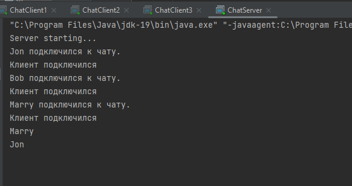
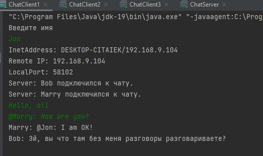
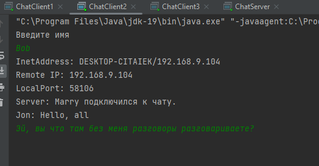
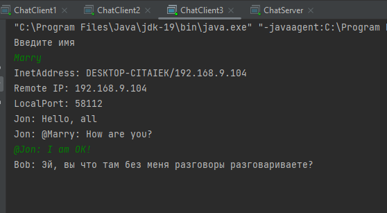

## Клиент/Сервер своими руками
1. Разработайте простой чат на основе сокетов как это было показано на самом семинаре. 
* Ваше приложение должно включать в себя сервер, который принимает сообщения от клиентов и пересылает их всем участникам чата. 
* (Вы можете просто переписать наше приложение с семинара, этого будет вполне достаточно)

2. (*) Подумайте, как организовать отправку ЛИЧНЫХ сообщений в контексте нашего чата, 
* доработайте поддержку отправки личных сообщений, небольшую подсказку я дал в конце семинара.

Скрины

